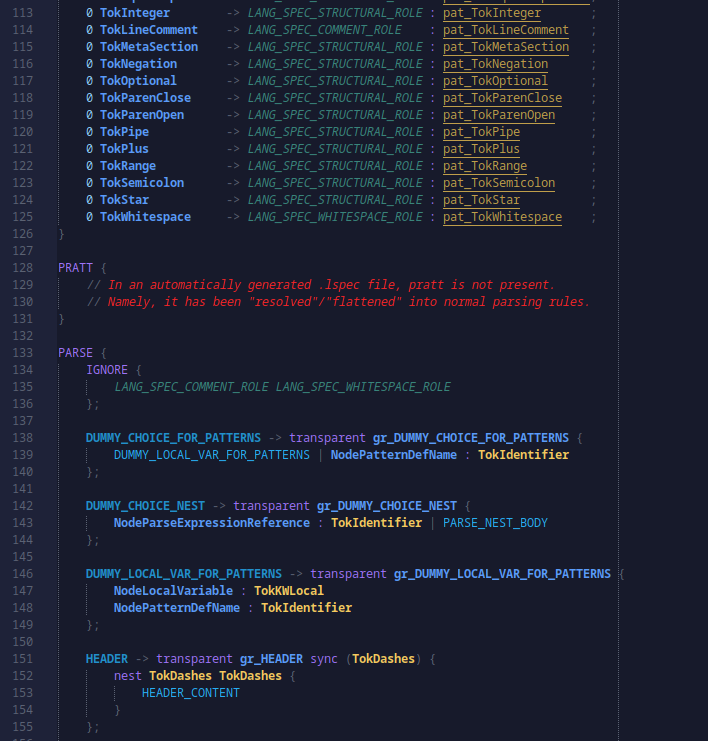

# LangSpec

LangSpec is a language specification and parsing ecosystem. It has two layers: a **generic parsing runtime** (the `langspec` package) and, built on top of that, a **meta-language and compiler** for `.lspec` files (the LangSpec DSL in `langspec/dsl` and subpackages). Most users author a `.lspec` and never touch the lower layer directly; library authors and tooling can use the core API without the DSL.

Validation logic is intentionally excluded from the `.lspec` grammar. Validation is semantic and requires imperative programming, so it is implemented on the Go side.

**New here?** See **[Getting started: build, hello world, and tests](docs/WALKTHROUGH.md)** for a step-by-step path through compiling the Go code, running the tiny `hello-lspec` example, and how tests are wired in this repository.

## Table of Contents

- [Getting started (walkthrough)](docs/WALKTHROUGH.md)
- [Sublime syntax generation algorithm](docs/sublime-syntax-generation.md)
- [LangSpec core vs. the LangSpec DSL](#langspec-core-vs-the-langspec-dsl)
- [Architecture & Pipeline](#architecture--pipeline)
- [Design Philosophy](#design-philosophy)
- [The LangSpec DSL](#the-langspec-dsl)
- [Validation](#validation)
- [Tooling & Integration](#tooling--integration)
  - [Codegen vs runtime](#codegen-vs-runtime)
  - [Go Bindings](#go-bindings)
  - [Sublime Text Syntax](#sublime-text-syntax)
- [Packages & API](#packages--api)
- [Contributing](#contributing)

---

## LangSpec core vs. the LangSpec DSL

| | **LangSpec core** (`langspec` package) | **LangSpec DSL** (`langspec/dsl`, `dsl/spec`, `dsl/semantics`) |
| --- | --- | --- |
| **Role** | Generic engine: turn **already-built** lexer/parser specs into a lexer, parser, and LST for **your** language’s source text. | Meta-language and pipeline: **define** languages in `.lspec`, **parse** those files, validate the definition, and **lower** them into the core types (`LexerSpec`, `ParserSpec`, `LangSpec`). |
| **Knows about** | Token types, node kinds, grammars, and LST shape **you** supply as Go types / compiled specs. | The `.lspec` syntax, PRAGMA/tool blocks, and the **LangSpec DSL’s** own lexer, parser, and validation stages. |
| **Typical entry points** | `LangSpecCreate`, `LangParserCreate`, `LangParserParseFile` — feed source in the language described by your specs. | `LangSpecCompilerCompile` or `bootstrap.CompileParserFromSpec` for a ready-made `LangParser` (compile only; no file-generating toolchains). |
| **Dependency** | Depends on `lexarch`, `syntaxa`, etc.; **does not** import `langspec/dsl`. | Depends on the core: the DSL compiler **outputs** the same structures the core consumes. |

In short: **core = run a language; DSL = describe and compile that language from a `.lspec` file.** The DSL is itself implemented with the core (self-hosting): the `.lspec` format is parsed using lexer/parser specs produced from the DSL definition in `dsl/spec`.

---

## Architecture & Pipeline

Language definitions are purely declarative data. All parsing algorithms and execution mechanics live in the runtime engine. You define your language in a `.lspec` file, and the DSL compiler transforms it into runtime structures (`LexerSpec`, `ParserSpec`, `LangSpec`) that drive the generic engine.

```text
DSL source (.lspec)  →  LangSpecCompilerCompile  →  LangSpecCompileResult
                                                           ↓
                                              CompiledLexerSpec, CompiledParserSpec
                                                           ↓
                                              LangSpecCreate  →  LangParser  →  LST
```

The core pipeline operates as: **raw source → lexing → parsing → Lossless Syntax Tree (LST)**.

---

## Design Philosophy

- **Data vs. Execution:** Language definitions are treated as data. The engine contains no domain logic.
- **Self-Hosting:** The LangSpec DSL is parsed by its own engine.
- **Separation of Concerns:** Lexer specs, parser specs, and editor IRs are fully independent.
- **Performance:** NFA-to-DFA lexer compilation with memory bounds, grammar-driven parsing with Pratt expression support, and single-pass LST compilation.

---

## The LangSpec DSL

LangSpec uses a custom meta-language to define both lexing and parsing rules in a single `.lspec` file.

- **[Read the full Syntax Reference](docs/syntax.md)** for detailed rules on patterns, expressions, and grammar constructs (including **`pair` declarations** and **`nest @PairName`** with a dedicated `TokPairReference` lexer rule).
- **[View a real-world example](examples/lspec.lspec)** to see how LangSpec defines its own syntax.
- **[View the collection of my own syntaxes created with LangSpec](https://github.com/LordMartron94/Lingua)** to see how my other grammars (whether DSL or real) are built using LangSpec

### Import/export system (module composition)

LangSpec supports cross-file grammar composition through:

- `IMPORT { "path/to/module.lspec" as Alias; }` at top level.
- `export` declarations for reusable external symbols (for example `export`ed patterns, parse rules, pairs, and templates).
- `using Alias.Symbol` and `using Alias.Template(args)` at parse/lex integration sites.

Import behavior is intentionally strict:

- External templates must be invoked as `using Alias.Template(...)` (shape/category validation reports `V_IMP006` on mismatch).
- Unknown imported exports report `V_IMP005`.
- Imported lexer symbols are referenced-only (unused imported patterns/tokens/states are not pulled into output), and imported states are namespaced to avoid collisions.
- Generated go_bindings also namespace imported token/node constants by import alias (`Alias__Name`) to avoid collisions across imported modules.
- Imported modules are parsed and stage-0..3 validated with the same pipeline as root specs. Import failures are surfaced with alias/path-context diagnostics.
- Library modules can relax executable-entry checks via non-tool pragma:
  - `PRAGMA { lspec { library = true; } }`
  - this disables `PROGRAM`-required (`V_PAR004`) and unresolved-local-reference checks (`V_PAR002`, `V_PAT002`, `V_LEX006`) for that module, while keeping import/export contract checks active.

### Embedded language handoff (`embed`)

LangSpec also supports full cross-module language embedding:

- Declare embedded modules in `IMPORT` via `embed "path/to/module.lspec" as Alias;`
- Use parse-site handoff syntax: `embed Alias nest OpenToken CloseToken`
- Compiler behavior:
  - merges embedded lexer states/rules into host namespaces (`Alias::INITIAL`, `Alias::Tok...`)
  - injects entry push on host open-token rules to `Alias::INITIAL`
  - injects exit pop rule in embedded root matching host close-token pattern
  - lowers parse statement to open -> embedded `PROGRAM` -> close
- Validation diagnostics for embed-specific misuse:
  - `V_IMP009` embed alias must be declared with `embed`
  - `V_IMP010` entry token must be reachable in host lexer
  - `V_IMP011` exit token pattern shadowed in embedded root rules

### 1. Header (Required)

```lspec
--- "MyLang" v1.0.0 | lspec v1.0.0 ---
```

The `lspec v…` segment declares a target LangSpec compiler version. That value is currently irrelevant to behavior (it need not match other projects’ `.lspec` files); in the future it may influence compatibility or migration pipelines.

### 2. PRAGMA (Optional)

Configures tooling like editor integrations or code generation.

```lspec
PRAGMA {
  tool.go_bindings {
    enable = true;
    output-path = "path/to/bindings.go";
    package-name = "mylang";
  }
  lspec {
    library = true;
  }
}
```

### 3. PATTERN (Optional)

Named pattern definitions for reuse in the lexer.

```lspec
PATTERN {
  local digit : [ '0'..'9' ];
  number : ( digit )+;
}
```

### 4. LEX (Required)

Defines token types, roles, and match priorities (higher integer = higher priority). Rules live inside **state** blocks; `INITIAL` is required. Optional `[push(…)]`, `[pop(N)]`, and `[set(…)]` suffixes (square brackets around the mutation; parentheses around arguments are required) change the lexer mode stack when that rule matches. See **[docs/syntax.md](docs/syntax.md)** §5.

```lspec
LEX {
  state INITIAL {
    2 TokIdent  -> identifier : `[a-zA-Z_]+`;
    1 TokNumber -> numeric    : number;
    0 EOF       -> structural : eof_pattern;  %% EOF=true %%
  }
}
```

### 5. PRATT (Optional)

Defines Pratt-style expression grammars (primary, prefix, postfix, infix, implicit).

```lspec
PRATT {
  local expr {
    primary { ident; }
    infix {
      "+" -> NodeAdd precedence 20 21;
    }
  }
}
```

### 6. PARSE (Required)

Defines the core grammar rules. Uses `output_node : token_ref` to distinguish tokens from rule references.

```lspec
PARSE {
  IGNORE { whitespace; };

  Statement -> NodeStatement {
    NodeIdent : TokIdent;
    ( expr )?;
  };
}
```

---

## Validation

It is critical to distinguish between validating the **LangSpec DSL (`.lspec` files)** and validating **your target language**.

### 1. Meta-Grammar Validation (Automatic)

Validation for `.lspec` files is semantic, imperative, and runs automatically in Go **after** a successful parse. The compiler builds a typed LST and runs a built-in pipeline of validation stages to ensure your grammar definition is logically sound. Results (`diagnostics`, `warnings`, `errors`, `fatal`) are collected in `ValidationEntries`.

| Stage | Validation Focus |
| --- | --- |
| **0** | Symbol binding, environment collisions, unresolved references. |
| **1** | Structure and reachability (cyclic references, dead rules). |
| **2** | Lexer semantics (ambiguous matches, shadowed tokens). |
| **3** | Pattern semantics (invalid negation) and repetition bounds in pattern and parse (`V_REP*`). |
| **4** | Grammar safety (left recursion, unbounded optionals, FIRST-set conflicts). |

### 2. Target Language Validation (Client Implemented)

LangSpec **does not** generate semantic validation for the language you define. The `.lspec` file dictates syntax and lexing rules, nothing more.

You must implement semantic validation for your target grammar yourself. You have two choices:

- **Use LangSpec's Framework:** Leverage our Go-side validation system by using `LSTValidatorConfigurationCreate` to define your own custom pipeline and `LSTValidatorRun` to execute it against your language's compiled root LST node.
- **Build Your Own:** Export the parsed LST and pass it through your own proprietary validation logic.

---

## Tooling & Integration

### Codegen vs runtime

`bootstrap.CompileParserFromSpec` only compiles the `.lspec` and builds a `LangParser` — it does **not** run go_bindings or Sublime generation. To emit those artifacts, run toolchains explicitly:

- **`bootstrap.RunToolchainsFromSpecFile(specPath, alloc, opts...)`** — compile the spec and run go_bindings, Sublime, and tm_comments per PRAGMA and options (e.g. `WithSublimeToolchain` for in-memory manifest, `WithTMCommentsToolchain` to override TM comment settings from Go).
- **`bootstrap.RunToolchainsFromCompileResult(result, opts...)`** — same, when you already have a `LangSpecCompileResult`.

From the **ruleforge repository root** (with `go.work`), the generic CLI is:

```bash
go run ./libs/langspec/cmd/langspec-toolchain -spec path/to/lang.lspec
```

From inside `libs/langspec`, use `go run ./cmd/langspec-toolchain -spec path/to/lang.lspec` instead.

It uses **`cliutil`**: same scratch allocator and `RunToolchains` wiring you would write in a custom `main`.

**Typed manifests (generated `Token`/`Node`):** the `go run` binary must **not** import your compiler package on the first step, or the package will not compile until bindings exist. Use **two** minimal `main` packages (e.g. `cmd/gen/bindings` then `cmd/gen/toolchains`), each a few lines calling `cliutil.NewGenerator` and `RunGoBindingsOnly` / `RunToolchains` with options from your package.

JSON-driven Sublime requires `tool.sublime` with `configuration-path` set in PRAGMA. In-memory Sublime (no JSON) requires `RunToolchainsFromSpecFile` (or `cliutil.Generator.RunToolchains`) with `WithSublimeToolchain` from a second generator binary that imports your compiler.

### Go Bindings

LangSpec can generate type-safe `Token` and `Node` constants from your spec to replace fragile string literals in your Go code.

1. Add `tool.go_bindings` to your `PRAGMA` block.
2. Run toolchains via `RunToolchainsFromSpecFile` (or `langspec-toolchain` above), or call `toolchain.RunGoBindingsToolchain` with a compile result.
3. Import the generated package to use strict `Token` and `Node` types in your compiler tooling.

Relative `output-path` values are resolved from the current working directory and its parents: if `src/compiler/out.go` is written but the generator runs from `src/compiler`, the toolchain picks the ancestor where `src/compiler/` already exists (typically the repo root), so paths anchored at the repository root work.

### Sublime Text Syntax



LangSpec builds a Push-Down Automaton IR to generate `.sublime-syntax` YAML files. This can be driven via JSON or in-memory Go configurations.

For the full pipeline (state graph, lexer stack reachability, IR binding, YAML emission, pruning, and failure modes), see **[docs/sublime-syntax-generation.md](docs/sublime-syntax-generation.md)**.

**Path 1: Using a JSON Manifest**
Add `tool.sublime` to your `PRAGMA` block with `configuration-path` pointing at a JSON manifest. Run `RunToolchainsFromSpecFile` or `langspec-toolchain` so the toolchain reads the JSON and generates the YAML.

**Path 2: In-Memory Manifest (Advanced)**
Call `RunToolchainsFromSpecFile` (or `RunToolchainsFromCompileResult`) with `WithSublimeToolchain(manifest, factory, fileExtensions, scopeExtension)`. PRAGMA must still set `enable` and `output-path`; `configuration-path` is ignored.

_Note: Complex overrides (like region-based block comments) cannot be expressed in JSON. You must provide a Go-based `OverrideProducer` via the `editor` registry._

### Sublime TM comments (.tmPreferences)

Add `tool.tm_comments` to PRAGMA with `enable`, `output-path`, exactly one of `scope` or `scope-extension`, `single-line-comment-start`, and optionally `block-comment-start` / `block-comment-end` (both required if you use block comments). Running `RunToolchainsFromSpecFile`, `RunToolchainsFromCompileResult`, or `langspec-toolchain` emits the plist file; templates ship inside the `toolchain` package via `go:embed` (no extra files in your repo). Restrict runs with `bootstrap.WithToolchainFilter("tm_comments", ...)` alongside other toolchain names.

---

## Packages & API

The workspace relies on synchronized git submodules (`lexarch`, `syntaxa`, `autarch`, `foundation`).

- **`langspec` (Root):** **Core runtime** — public API for parsers and specs (`LangSpecCreate`, `LangParserCreate`, `LangParserParseFile`). Use this when you already have compiled specs (from any source), or when building tooling that should not depend on the `.lspec` language.
- **`dsl`:** **DSL compiler** — compiles `.lspec` source into core specs (`LangSpecCompilerCompile`); re-exports types aligned with `dsl/spec`.
- **`dsl/spec`:** Meta-language definition (lexer/parser enums and grammar construction for `.lspec`).
- **`dsl/semantics`:** Semantic environment and DSL-specific LST validation stages.
- **`validation`:** Go-side LST validation framework.
- **`editor` / `editor/sublime`:** Generic push-down automaton IR and YAML generator for syntax highlighting.
- **`toolchain`:** Helpers for executing Go bindings, Sublime syntax generation, and TM comment preferences.
- **`bootstrap`:** `CompileParserFromSpec` builds a `LangParser` from a `.lspec` (no codegen). `RunGoBindingsFromSpecFile` emits go_bindings only; `RunToolchainsFromSpecFile` / `RunToolchainsFromCompileResult` run go_bindings, Sublime, and tm_comments per PRAGMA for `//go:generate` or CI.
- **`cliutil`:** Shared scratch allocator + `Generator` wrapping `RunGoBindingsFromSpecFile` and `RunToolchainsFromSpecFile` for thin `//go:generate` commands.

---

## Contributing

LangSpec is under active development. If you encounter edge cases in pattern recursion, Pratt parsing, or recovery, contributions are welcome.

- **Known edge case (metascopes):** Metascope behavior is currently reliable only when the related LangSpec construct is marked as a `nest`. In other structures it can be inconsistent (hit and miss).
- **Maintenance stance:** Pull requests to improve or fix this are appreciated. I do not plan to spend time fixing this myself in the foreseeable future because the issue is complex and currently minor in practice.
- **Pull Requests:** Keep them focused. Include a clear description and testing methodology. Do not use `*_test.go` files for general tests; follow the project's custom test framework conventions (`_tests.go`).
- **Issues:** Provide a minimal `.lspec` reproduction for bug reports.
